# SKS Migration Center 使用手册：Nextcloud Compose 与 React + PostgreSQL 实迁演示

本文以两条真实迁移任务说明平台的完整使用方法：

- Docker Compose：`nextcloud-redis-mariadb`，源端为 `192.168.112.51`，包含 Nextcloud、MariaDB、Redis 与两个 named volume。
- Kubernetes：`react-db-demo`，源端为 sida 集群，包含 Frontend、PostgREST、PostgreSQL 与一个 PVC。

两条任务均迁移到目标 SKS `target-sks`，完成业务数据校验、人工切流确认及源端恢复。文档中的密码、SSH 私钥、kubeconfig 和 Harbor Token 均不展示。

## 1. 演示结果

| 场景 | 最终状态 | 目标资源 | 数据验证 | 源端恢复 |
| --- | --- | --- | --- | --- |
| Nextcloud Compose | 成功 | 3 Deployment、3 Service、2 PVC | `头像.png` SHA-256 与源端一致；Nextcloud 可登录 | 3 个 Compose 服务恢复运行 |
| React DB Kubernetes | 成功 | 3 Deployment、3 Service、1 PVC | PostgreSQL 中 5 条记录完整，包含演示新增记录 | sida 中 3 个 Deployment 恢复原副本数 |

任务列表会同时显示迁移状态、进度和实际传输数据量。

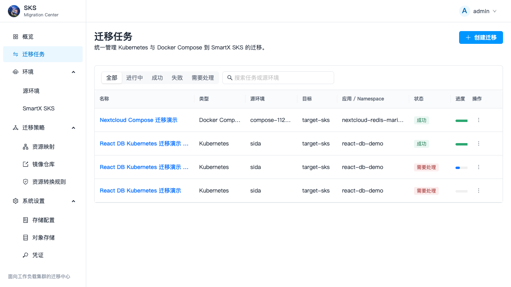

## 2. 迁移前准备

### 2.1 平台和环境

1. 登录 SKS Migration Center。
2. 在“环境 / 源环境”注册 Docker Compose 主机或 Kubernetes 源集群。
3. 在“环境 / SmartX SKS”注册目标工作负载集群。
4. 在“系统设置 / 对象存储”确认 MinIO 可用。
5. 为参与迁移的源、目标 Kubernetes 集群安装或复用 Velero。
6. 确认源端与目标端的 Velero BackupStorageLocation 使用同一个 Endpoint、Bucket 和 Prefix。

> 源、目标 BSL 的 Prefix 必须一致。平台的新版本会在执行期检查中直接阻止不一致配置，避免任务在“目标恢复”阶段无限等待。

平台概览示例：

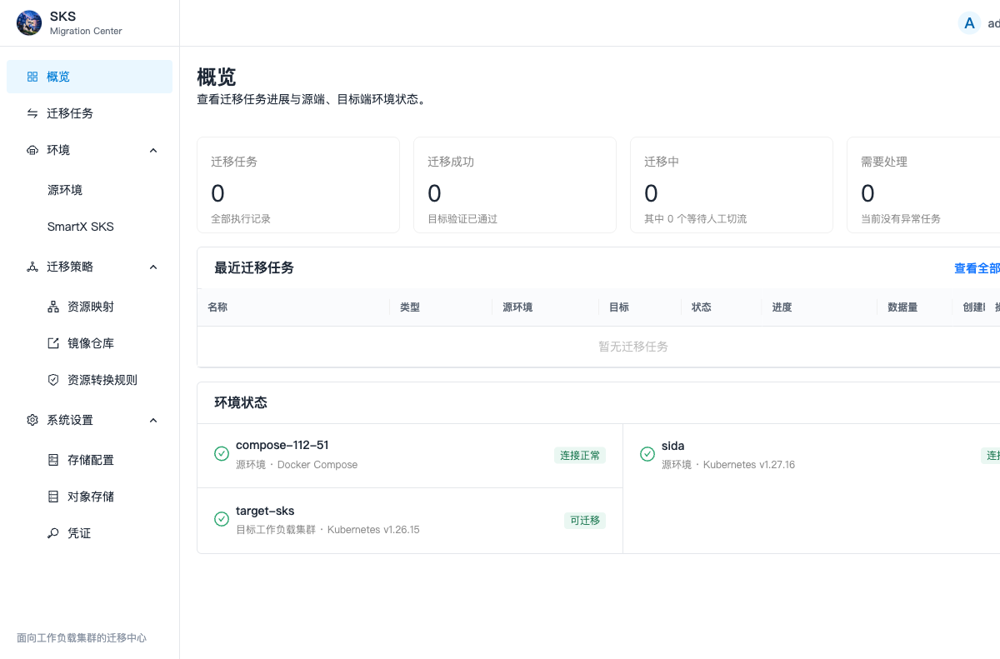

### 2.2 Harbor 镜像准备

Compose 迁移会在执行期检查阶段自动处理镜像：

1. 从 Compose 主机确认每个 Service 的实际镜像。
2. 对本地构建镜像和公有镜像统一打标签。
3. 尝试创建应用专属的 Harbor 公有项目。
4. 项目创建失败时回退到部署时配置的 Harbor 仓库。
5. 推送镜像并将目标 Deployment 改写为 Harbor 地址。

Kubernetes 迁移应配置 Registry/Image 映射，或预先保证目标集群能够拉取源镜像。目标集群不能访问公网时，不应直接保留 Docker Hub 镜像地址。

### 2.3 业务数据基线

迁移前必须准备可核验的数据，不能只检查 Pod 是否 Running。

本次 Nextcloud 源端上传了 `头像.png`：

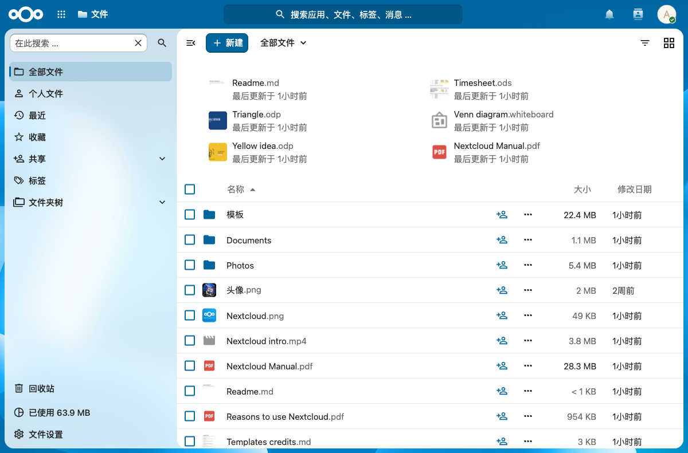

源文件校验值：

```text
059d93ce67021b072057e445644850624d628312557a7848ee9fd28de76f7452
```

本次 React DB 源端共有 5 条记录，其中新增：

```text
迁移演示数据-20260920-01
```

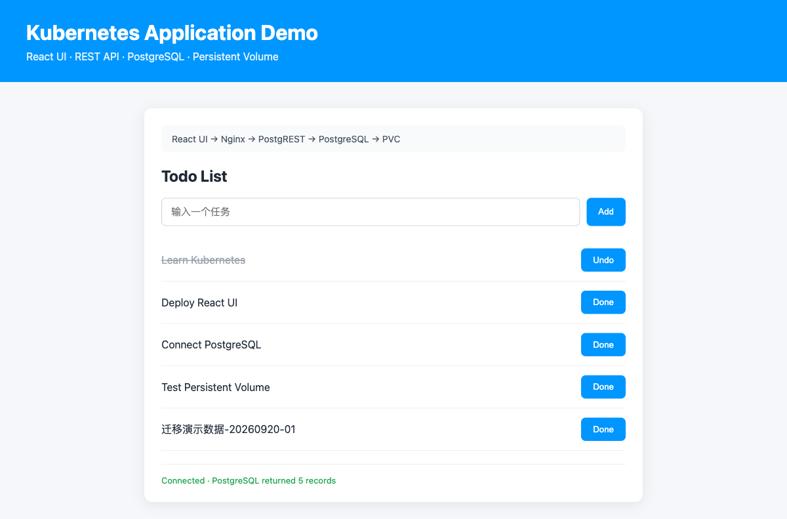

## 3. 创建迁移计划

### 3.1 选择源应用

Kubernetes 支持两种选择方式：

- 自动发现应用：按 Namespace 和资源关系发现完整业务。
- 按 Namespace 手选资源：可选择指定 Deployment、Service、Ingress、PVC、ConfigMap、Secret 等资源组合。

Docker Compose 应用来自 `docker compose ls -a` 及其 Config Files。平台从源主机读取完整 Compose 定义、`.env`、volume、network、config 和 secret 引用；不要只上传一个脱离源目录的 compose.yaml。

### 3.2 迁移评估

选择目标 SKS 后执行迁移评估：

- BLOCKER 必须清零后才能创建计划。
- WARNING 可继续，但应打开得分详情确认具体资源和建议。
- 检查 StorageClass、IngressClass、镜像、NodeLabel、API Version、Compose bind mount 与外部依赖。

### 3.3 目标映射

目标映射不是必选项：

- Compose 未选择映射时，平台按应用名自动创建目标 Namespace，并自动生成 Kubernetes 资源。
- Kubernetes 只有匹配到映射规则时才改写 Namespace、StorageClass、Registry、IngressClass、NodeLabel 等字段；没有匹配规则时保留源值或使用平台安全默认值。

### 3.4 数据策略

- Compose 有 named volume 或 bind mount 时选择 `COMPOSE_KOPIA`。
- Kubernetes PVC 文件级迁移选择 Velero FSB。
- 支持 CSI Snapshot Data Mover 的环境可选择 CSI 数据移动。
- 无卷应用可选择不迁移卷数据，平台不会停源端业务。

## 4. Compose Nextcloud 迁移

### 4.1 迁移对象

源应用：

- `nc`：Nextcloud Apache
- `db`：MariaDB
- `redis`：Redis
- `nc_data`：Nextcloud 数据卷
- `db_data`：数据库卷
- `dbnet`：Compose 网络

目标 Namespace：`nextcloud-redis-mariadb`

### 4.2 平台执行时序

1. **执行期检查**：镜像自动镜像到 Harbor；Kompose 转换并校验清单；检查 Kopia 仓库。
2. **在线预同步**：业务保持运行，分别为 `db-data` 和 `nc-data` 创建 Kopia 快照。
3. **停止源业务**：执行 Compose stop，进入最终一致性窗口。
4. **最终备份**：创建停止源业务后的增量快照。
5. **数据传输**：确认最终快照已位于目标 MinIO。
6. **资源转换与映射**：生成并规范化 Deployment、Service、PVC 等资源，镜像改写为 Harbor 地址。
7. **目标恢复**：先创建暂停副本的资源和 PVC，恢复卷后再启动工作负载。
8. **业务验证**：逐资源检查 Deployment、Service、PVC 和配置的探测项。
9. **等待人工切流**：目标验证通过后，由管理员完成 DNS、负载均衡或入口调整并点击“确认切流”。
10. **恢复源端**：演示或回滚场景点击“恢复源端”，源 Compose 服务重新启动，目标资源保留用于核验。

资源拓扑同时展示源 Compose、转换关系和目标 Kubernetes 资源：

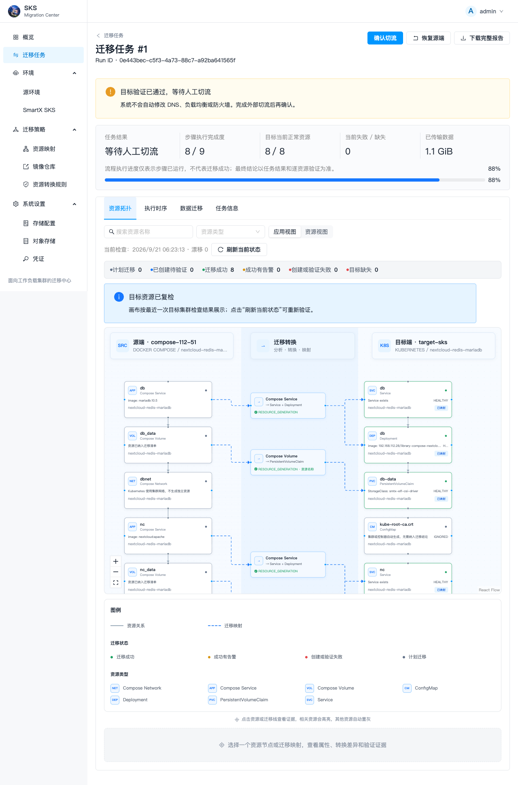

数据迁移页展示每个 volume 的引擎、快照、传输字节数及状态：

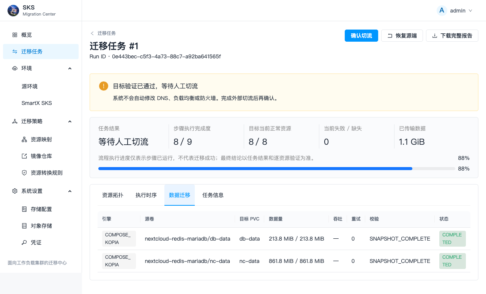

完整执行时序会记录镜像同步、Kopia 快照、源端停止、资源应用、验证、切流和源端恢复：

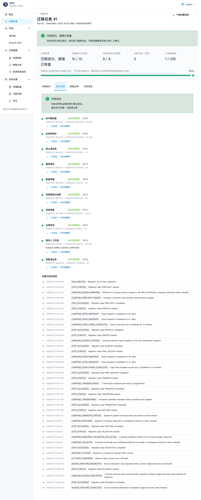

### 4.3 数据验证

目标 Nextcloud：

- 可使用原管理员账号登录。
- `头像.png` 可在“文件”中看到。
- 目标容器内 SHA-256 为 `059d93ce67021b072057e445644850624d628312557a7848ee9fd28de76f7452`，与源端一致。

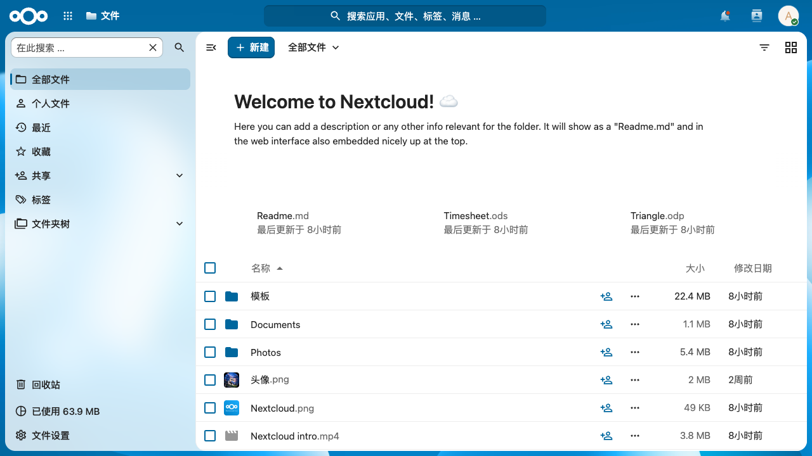

源端恢复后：

- `db`、`nc`、`redis` 均为 running。
- 源端 Nextcloud 返回 HTTP 200。
- 源端 `头像.png` SHA-256 仍与迁移前一致。

## 5. Kubernetes React DB 迁移

### 5.1 迁移对象

源 Namespace：`react-db-demo`

- Deployment：`frontend`、`api`、`postgres`
- Service：`frontend`、`api`、`postgres`
- PVC：`postgres-data`，10 GiB
- 数据库：PostgreSQL，表 `api.todos`

目标 Namespace：`react-db-demo`

### 5.2 平台执行时序

1. **执行期检查**：校验源、目标 BSL 均 Available，并确认 Endpoint、Bucket、Prefix 一致。
2. **在线预同步**：创建 Velero Backup，通过 FSB 在线备份 PostgreSQL PVC。
3. **停止源业务**：记录原副本数并将有状态业务副本缩容到 0。
4. **最终备份**：生成最终一致性 Backup。
5. **数据传输**：确认 PodVolumeBackup 完成，记录字节数。
6. **资源转换与映射**：准备 StorageClass 等恢复映射。
7. **目标恢复**：目标 Velero 同步 Backup，恢复 Kubernetes 资源和 PVC，再恢复原副本数。
8. **业务验证**：逐个验证 Deployment 副本、PVC Bound、Service 及业务探测。
9. **等待人工切流**：人工确认外部流量切换。
10. **恢复源端**：按快照恢复 sida 上的原始副本数。

完成后的资源证据拓扑：

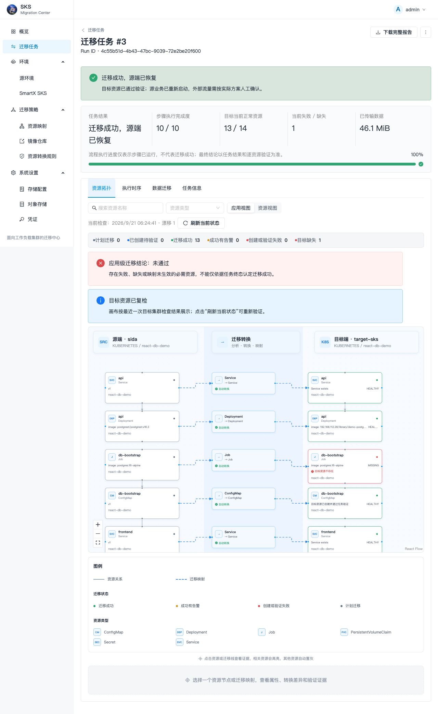

执行时序：

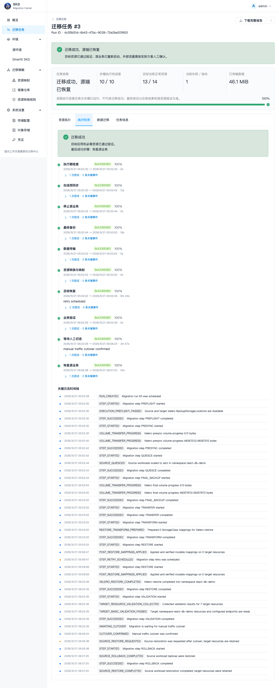

PVC 数据传输证据：

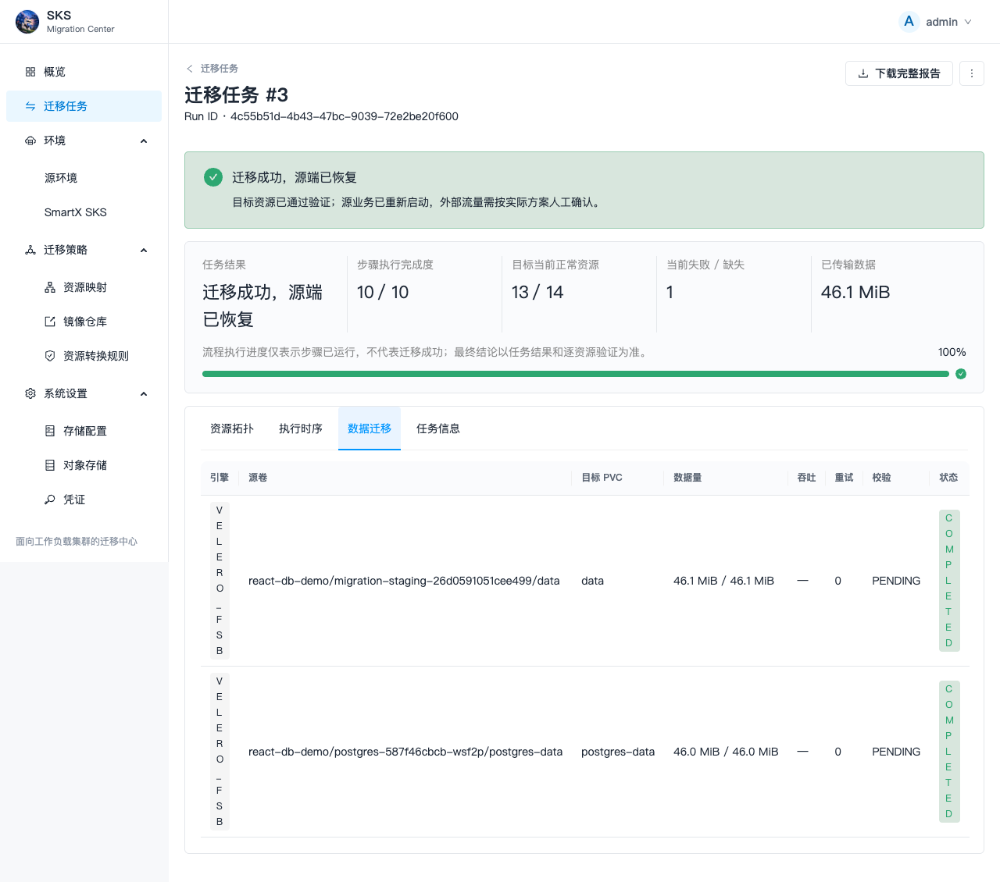

### 5.3 数据验证

目标 PostgreSQL `api.todos` 返回 5 条记录，包含迁移前新增的：

```text
迁移演示数据-20260920-01
```

目标 Web 页面也展示完整记录：

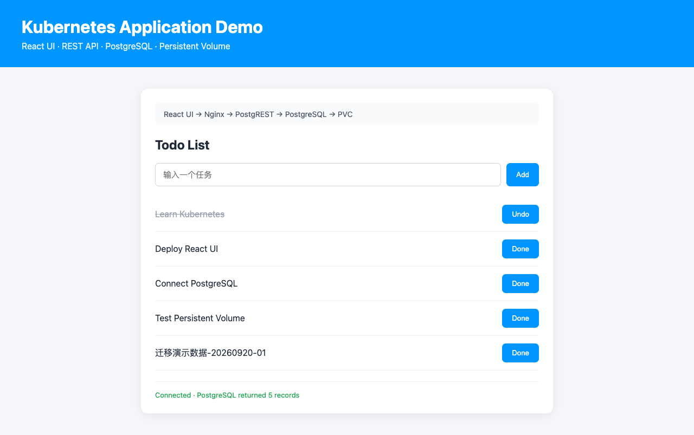

源端恢复后：

- sida 的 `frontend` 恢复为 2/2。
- `api` 和 `postgres` 恢复为 1/1。
- 源端 API 仍返回 5 条记录及相同的第 5 条演示数据。

## 6. 如何判断迁移成功

不能只看“流程 100%”或 Pod Running。必须同时满足：

1. 任务结果为“迁移成功”或“迁移成功，源端已恢复”。
2. 资源拓扑中必需目标资源为绿色，失败和缺失为 0。
3. PVC/Volume 传输完成，传输字节数合理。
4. 映射后的实际字段与期望一致。
5. 业务访问正常。
6. 数据库记录、文件哈希或业务计数与源端基线一致。
7. 需要恢复源端时，原副本数或 Compose 服务均已恢复。

## 7. 本次实迁发现并修正的问题

### 7.1 Velero 离线安装拉取公网 kubectl

原因：Velero Chart 的 namespace labels 配置会生成 Helm Hook Job，并拉取 `registry.k8s.io/kubectl`。

修正：平台已通过 Kubernetes API 直接维护 namespace labels，不再向 Helm 传入该配置，避免离线环境访问公网。

### 7.2 旧 BackupRepository 缓存旧 MinIO 地址

原因：源集群曾经使用旧 MinIO，Velero BackupRepository 的 repository identifier 仍引用旧地址。

处理：清理对应业务 Namespace 的旧 BackupRepository，让 Velero 按当前 BSL 重建仓库。业务资源和数据不受影响。

### 7.3 源、目标 BSL Prefix 不一致

原因：源端写入 `migrations/sida`，目标端读取 `migrations/target-sks`，目标无法发现源 Backup。

修正：本次统一 Prefix；代码新增执行期一致性校验，直接报告源/目标 Endpoint、Bucket、Prefix 差异，不再静默等待。

### 7.4 目标集群不能访问 Docker Hub

原因：恢复的 Kubernetes 清单保留了公网镜像地址，而目标节点无公网访问能力。

处理：将 `nginx`、`postgrest`、`postgres` 镜像镜像到联动 Harbor，并在目标 Deployment 中使用 Harbor 地址。生产使用时应提前配置 Registry/Image 映射。

## 8. 常用核验命令

以下命令仅展示方法，请替换 kubeconfig、Namespace 和资源名称。

```bash
# 目标工作负载和 PVC
kubectl --kubeconfig target.yaml -n react-db-demo get deploy,pod,svc,pvc

# 验证 PostgreSQL 记录
kubectl --kubeconfig target.yaml -n react-db-demo exec deploy/postgres -- \
  psql -U postgres -d demo -Atc 'select id,title,completed from api.todos order by id'

# 验证 Nextcloud 文件哈希
kubectl --kubeconfig target.yaml -n nextcloud-redis-mariadb exec deploy/nc -- \
  sha256sum '/var/www/html/data/admin/files/头像.png'

# 查看源 Compose 是否恢复
docker compose -f /path/to/compose.yaml ps
```

## 9. 本次任务标识

便于在平台、审计日志和报告中检索：

- Nextcloud Run ID：`0e443bec-c5f3-4a73-88c7-a92ba641565f`
- React DB 成功 Run ID：`4c55b51d-4b43-47bc-9039-72e2be20f600`

两个 Run 均已完成切流确认、目标数据验证和源端恢复。
