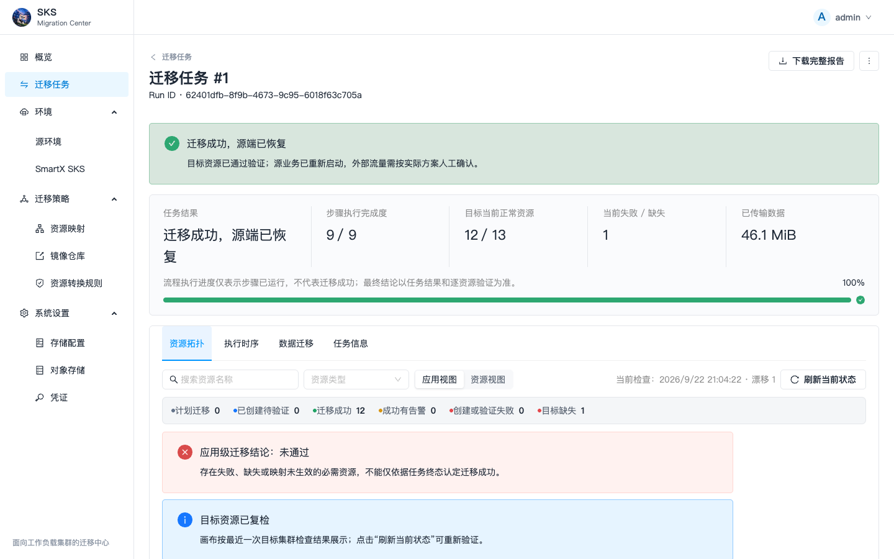
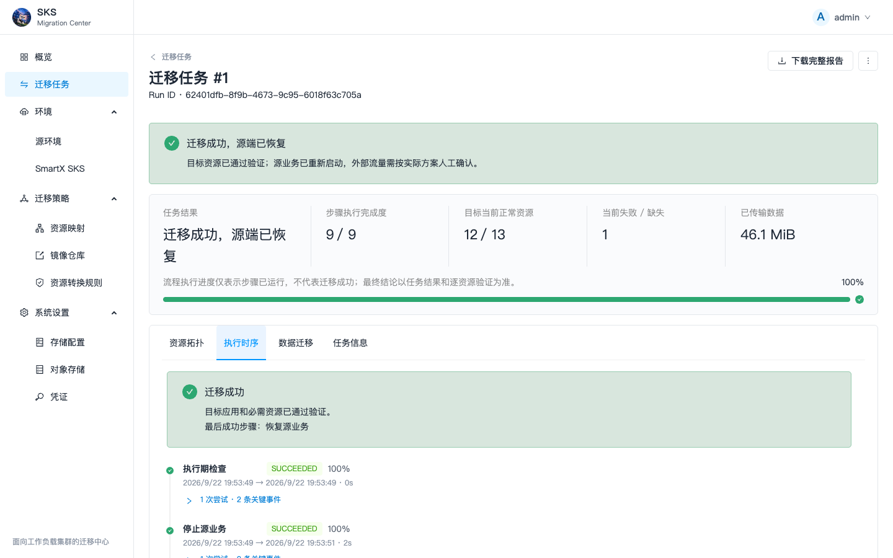
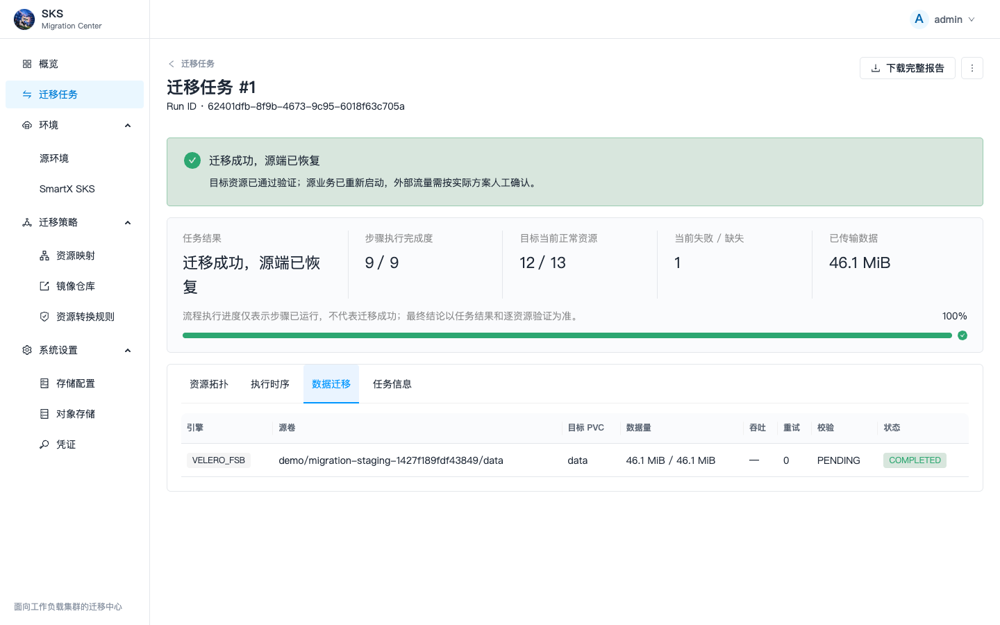
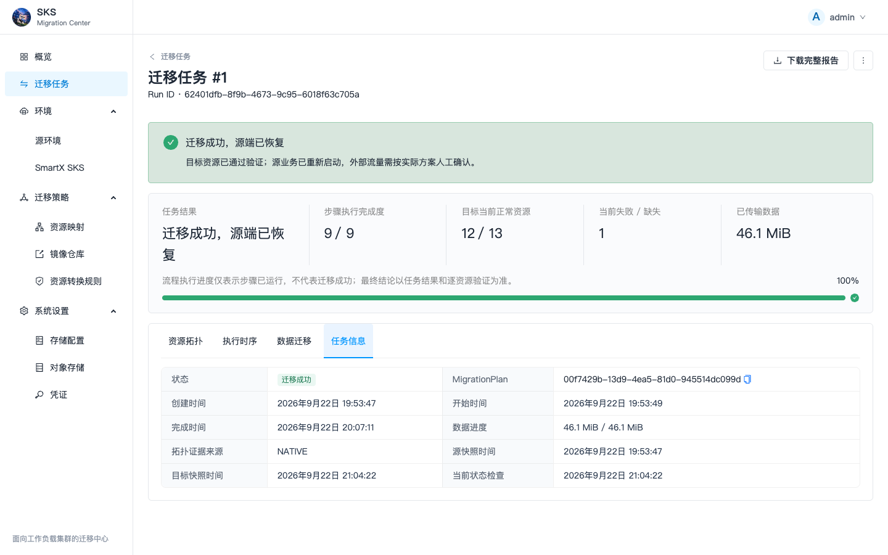
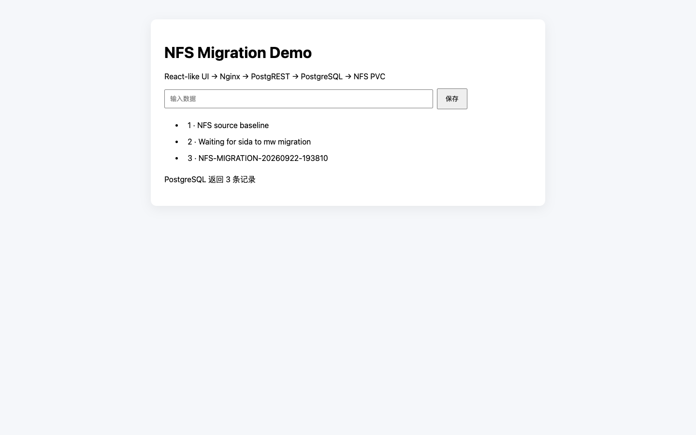

# Kubernetes NFS 卷迁移验证与操作手册

## 1. 验证结论

本次验证使用 SKS Migration Center 将 `sida` 集群 `demo` Namespace 中的三层应用迁移到 `mw` 集群的同名 Namespace。PostgreSQL 数据卷由 NFS CSI 动态供应，源端和目标端均连接 `192.168.112.51:/maven-nfs`。

验证结果：

- 源端和目标端的 Deployment、Service、ConfigMap、Secret、PVC 均已创建并运行正常。
- 源端 `postgres-data` 与目标端 `postgres-data` 使用不同 CSI 子目录，不是两个 Pod 直接挂载同一目录。
- Velero 文件系统备份实际传输了 `48,308,850` 字节（约 `46.1 MiB`）。
- 源、目标 API 返回相同的 3 条业务记录，规范化 JSON 的 SHA-256 均为 `a3911bc1a3d44633d5db39192ba1296cf0bee7195b613a89ac353bc366bffe4d`。
- 目标卷中的迁移标记文件 SHA-256 为 `cfa63cdb9831b73d84baa8c628422eb922bfa40bed4030dd0fdd7bd0ff557e08`。
- 人工切流确认后执行了“恢复源端”，源端副本已恢复，目标端资源保留。

任务地址：<http://192.168.118.206:31500/migrations/62401dfb-8f9b-4673-9c95-6018f63c705a>

## 2. 测试拓扑

| 项目 | 源端 | 目标端 |
| --- | --- | --- |
| 集群 | sida | mw |
| Namespace | demo | demo |
| 业务组件 | frontend、api、postgres | frontend、api、postgres |
| PVC | postgres-data，RWX，2 GiB | postgres-data，RWX，2 GiB |
| StorageClass | sks-fluid-nfs-source | sks-fluid-nfs-target |
| NFS | 192.168.112.51:/maven-nfs | 192.168.112.51:/maven-nfs |
| NFS 协议 | v3 | v3 |
| 访问入口 | NodePort 31818 | NodePort 30835 |

源 PV 与目标 PV 的 `volumeHandle` 分别为：

```text
192.168.112.51#maven-nfs#pvc-9ecc5f74-73ed-4ac9-8b11-83ca2245fc94##
192.168.112.51#maven-nfs#pvc-d51e07b5-138f-431d-b7e5-e9b31cc9f68c##
```

两个句柄指向同一 NFS 导出下的不同动态子目录，因此目标数据来自迁移复制，不是共享同一 PVC 目录造成的“看起来一致”。

> 本环境的 `/maven-nfs` 是普通 NFSv3 导出；NFSv4 伪根位于 `/mnt/sks`，所以 StorageClass 使用 `nfsvers=3`。交付到其他环境时应以服务端实际导出方式为准。

## 3. 迁移前准备

### 3.1 网络与 NFS

迁移前确认两个集群节点都能访问 NFS 服务端的 2049 端口，并验证导出路径。目标 StorageClass 必须已存在，且访问模式、协议和挂载参数满足源 PVC 要求。

本次最初评估的 `20.20.20.71:/sks-fluid` 只能从 `mw` 访问，`sida` 没有对应路由，因此改用两个集群均可达的 `192.168.112.51:/maven-nfs`。这类网络问题应在创建迁移计划前解决，不应依赖迁移过程中临时转发。

### 3.2 平台存储配置

在“系统设置 → 存储配置”中创建或选择 NFS 存储配置，并执行持久化验证。本次平台配置为：

- 名称：`maven-nfs-migration-test`
- 类型：`EXISTING_NFS_SC`
- 目标 StorageClass：`sks-fluid-nfs-target`
- 验证：动态创建 PVC、写入、卸载、重新挂载、读取 128 字节以及清理全部通过

### 3.3 Velero 对象存储一致性

平台可以只维护一个 MinIO/Object Storage 配置，但源集群和目标集群中各自存在一个 Velero `BackupStorageLocation`（BSL）对象。执行 Kubernetes 卷迁移时，两端 BSL 的下列字段必须一致：

- S3 endpoint
- bucket
- prefix

“平台只有一个 MinIO”并不意味着两个集群里已有的 BSL 会自动改写为同一值。集群可能在不同时间安装、复用或手工修改过 Velero。当前 v0.2.0 的加固版本会在执行期检查两端仓库标识，不一致时直接阻止任务并显示两端实际值，避免备份完成后目标端长期等待。

## 4. 平台操作步骤

### 4.1 发现应用并确认源数据

在 sida 源环境中发现 `demo` 应用，确认三项工作负载均 Ready，PVC 为 Bound。迁移前通过前端写入记录 `NFS-MIGRATION-20260922-193810`。


### 4.2 创建资源映射

本次映射包含：

- Namespace：`demo` → `demo`
- StorageClass：`sks-fluid-nfs-source` → `sks-fluid-nfs-target`
- NFS：`192.168.112.51:/maven-nfs` → `192.168.112.51:/maven-nfs`

创建计划后执行迁移评估，确认无 Blocker。本次采用 `FS_BACKUP`，平台执行顺序为：

1. 执行期检查
2. 停止源业务
3. 最终备份
4. 数据传输
5. 资源转换与映射
6. 目标恢复
7. 业务验证
8. 等待人工切流
9. 恢复源业务

### 4.3 查看资源拓扑

拓扑应显示 PVC 的 StorageClass 已从源端映射到目标端，并能查看资源关系与映射证据。



截图中显示的“漂移 1”是当时在线版本把源 StorageClass 名称误当成目标必需资源造成的展示误判；实际 PVC 已使用 `sks-fluid-nfs-target` 且为 Bound。代码已修复为按照 StorageClass 映射后的目标名称生成期望拓扑，并新增了回归测试。该提示与 MinIO 数量、NFS 数据完整性无关。

### 4.4 查看执行时序

执行时序可看到停止源业务、最终备份、恢复、验证、人工切流和恢复源业务的完成状态。最终备份事件记录了 `48,308,850 / 48,308,850` 字节。



### 4.5 查看数据迁移

数据迁移页显示引擎为 `VELERO_FSB`，卷任务状态为 `COMPLETED`，传输量为 `46.1 MiB / 46.1 MiB`。



### 4.6 确认切流并恢复源端

“确认人工切流”表示管理员已经在平台外完成或确认业务入口切换，例如 DNS、负载均衡、Ingress 或 NodePort 访问地址。它不是平台自动修改外部流量。

目标验证通过后，可在任务操作中执行“恢复源端”。该操作恢复迁移前记录的工作负载副本数，目标资源不会被删除。本次最终状态为“迁移成功，源端已恢复”。



## 5. 数据完整性验证

### 5.1 业务数据

目标端前端能够读取迁移前写入的 3 条记录，包括迁移标记 `NFS-MIGRATION-20260922-193810`。



源、目标 API 的规范化 JSON SHA-256：

```text
a3911bc1a3d44633d5db39192ba1296cf0bee7195b613a89ac353bc366bffe4d
```

### 5.2 卷内数据

目标 PVC 中迁移标记文件的 SHA-256：

```text
cfa63cdb9831b73d84baa8c628422eb922bfa40bed4030dd0fdd7bd0ff557e08
```

### 5.3 运行状态

- sida/demo：postgres 1/1、api 1/1、frontend 2/2 Ready
- mw/demo：postgres 1/1、api 1/1、frontend 2/2 Ready
- 源 PVC 与目标 PVC：均为 Bound
- 目标业务入口：NodePort 30835，可正常读出迁移数据

## 6. v0.2.0 交付说明

此 NFS 场景的核心功能已经验证通过，可以用于交付，但应使用 GitHub Release 中当前的完整离线资产，并遵守以下前置条件：

1. 源、目标集群都能访问 NFS 服务端和对象存储。
2. 目标 StorageClass 已创建并通过平台持久化验证。
3. 源、目标 Velero BSL 的 endpoint、bucket、prefix 完全一致。
4. NFS 协议版本与服务端导出方式匹配。
5. 迁移前确认目标 Namespace 不存在同名冲突资源，或明确处理策略。

当前离线资产校验信息：

```text
文件：sks-migration-center-0.2.0-linux-amd64.tar.gz
SHA-256：以同目录的 sks-migration-center-0.2.0-linux-amd64.tar.gz.sha256 为准
镜像数量：16
架构：linux/amd64
```

本次在线环境的 Worker 早于仓库一致性检查加固版本，因此曾允许两端 BSL 不一致并进入等待；交付使用的重新构建资产包含仓库一致性检查和 StorageClass 拓扑展示修复。上述旧截图保留为问题证据，不影响已经验证通过的实际数据迁移路径。

## 7. 证据标识

| 类型 | ID |
| --- | --- |
| Application | `30d63d85-a297-4855-aebd-4204414abeaa` |
| Assessment | `47e4e7ad-57d2-4ab5-b732-00b50dcfc43a` |
| MappingProfile | `4c21b580-643c-49ca-88a7-8ca5594ec907` |
| MigrationPlan | `00f7429b-13d9-4ea5-81d0-945514dc099d` |
| MigrationRun | `62401dfb-8f9b-4673-9c95-6018f63c705a` |
| StorageProfile | `889fbea1-9045-4b42-b134-19affd93183f` |
